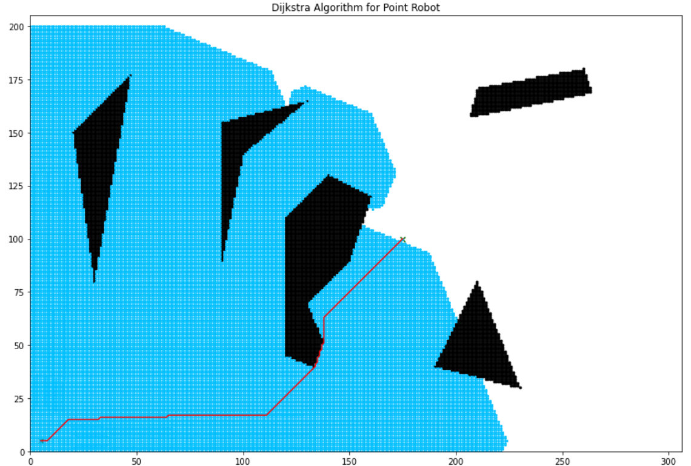

# 2DGrid_Based_Motion_Planning

In the above project, A* and Djikstra Algorithm are used to compute the shortest path from start to goal point in a discretized search place full of obstacles.

The Following Libraries are used:
* Numpy
* copy
* matplotlib
* heapq
* math
* sys

Motion planning for both rigid and point robot is devised.

A* Search Algorithm

Dijktra Algorithm

