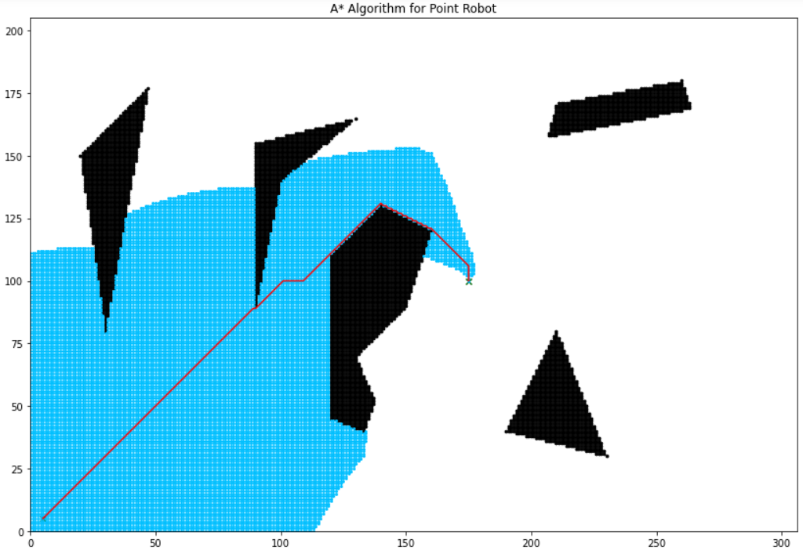
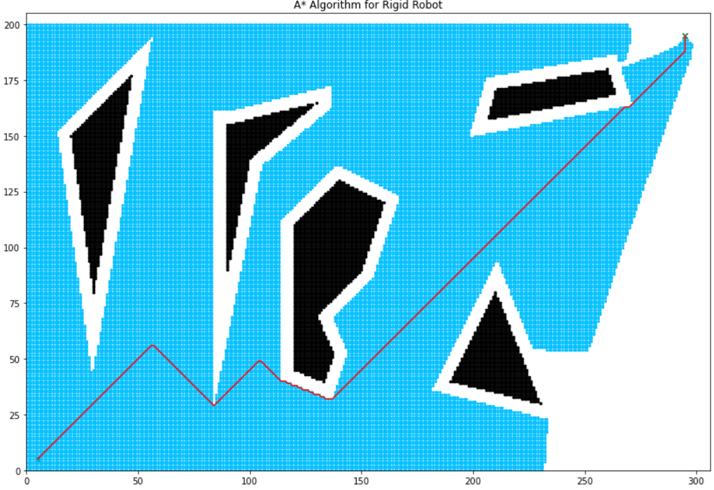

# 2DGrid_Based_Motion_Planning

In the above project, A* and Djikstra Algorithm are used to compute the shortest path from start to goal point in a discretized search place full of obstacles.

The Following Libraries are used:
* Numpy
* copy
* matplotlib
* heapq
* math
* sys

Motion planning for both rigid and point robot is devised. In case of a rigid robot, both radius and clearance is considered while creating the free C space of the 
robot. 

## A* Search Algorithm
In case of A* search, the estimated total cost is calculated as the sum of past cost and optimistic cost to go. A* search is guaranteed to return a minimum 
cost path efficiently as it uses the optimistic cost go to guide the algorithm to the optimum path. Optimistic cost to go is taken as the manhattan distance. 

## Dijktra Algorithm
In dijkstra Algorithm the estimated total cost is taken as zero. It is also guaranteed to find a minimum-cost path but it runs slowly than A* owing to the lack of an optimistic cost-ahead function to help guide the search

